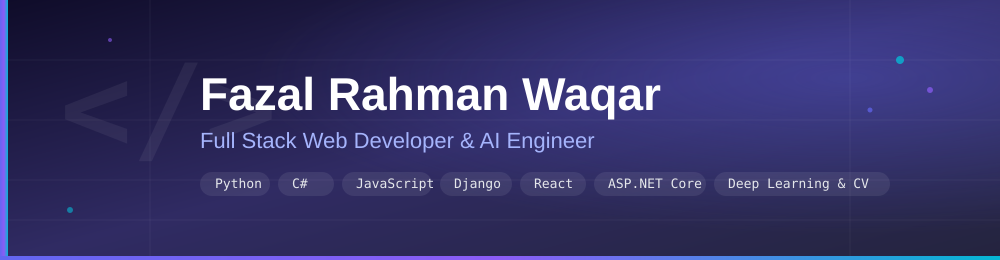

  

 

## About Me 👋

- 🎓 B.Sc. Computer Science — Nangarhar University (2023)
- 💻 Full Stack Web Developer — Django, ASP.NET Core, React
- 🧠 AI Engineer — Deep Learning & Computer Vision
- 🖥️ Also build desktop apps with C# Windows Forms, PyQt6 & PySide6
- 🌱 Currently sharpening system design & scalable API architecture
- 🤝 Open to full stack roles, freelance work, and collaboration
- 📫 Reach me at **[fazalrahmanwaqar3@gmail.com](mailto:fazalrahmanwaqar3@gmail.com)**

 

## Tech Stack 🛠️

**Languages**
 

**Web Development**
 

**AI & Computer Vision**
 

**Desktop Development**
 

 

## GitHub Stats 📊

 

## Contribution Activity 🐍

This animation is generated by a GitHub Action in your own repo (see setup below), so it doesn't depend on any third-party server and won't go down.

 

## Daily Work Monitoring 📅

This profile tracks daily development activity automatically. A scheduled GitHub Action runs every day, pulls that day's commit activity, and appends it to [`WORKLOG.md`](./WORKLOG.md).

| | |
|---|---|
| **Log file** | [`WORKLOG.md`](./WORKLOG.md) |
| **Update schedule** | Daily at 23:00 UTC |
| **Automation** | [`.github/workflows/daily-log.yml`](./.github/workflows/daily-log.yml) |
| **What it tracks** | Commits made that day, repos touched, and total commit count |

 

## Featured Projects 🚀

| Project | Stack | Description |
|---|---|---|
| Django REST Platform | Python, Django, React | Full stack web app with a REST API backend and React frontend |
| ASP.NET Core Service | C#, ASP.NET Core | Backend microservice built on .NET Core |
| Computer Vision Pipeline | Python, OpenCV, YOLO | Real-time object detection and tracking |
| Desktop Utility Suite | Python, PySide6/PyQt6 | Cross-platform desktop app with a native Qt interface |

 

---

Updated automatically · Fazal Rahman Waqar

